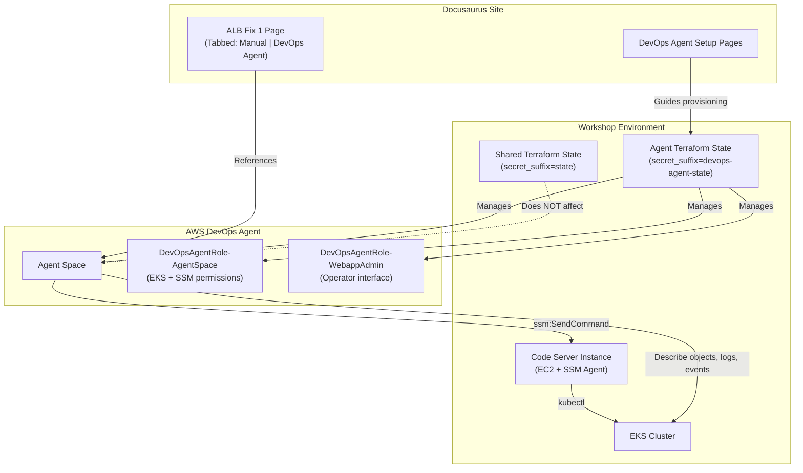
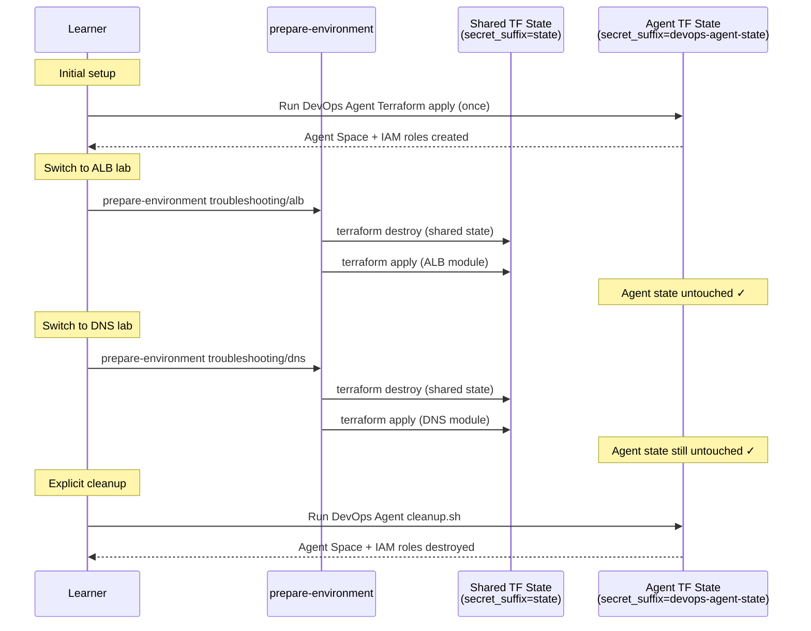

# Design Document: DevOps Agent Troubleshooting Integration

## Overview

This design integrates the AWS DevOps Agent into the EKS Workshop troubleshooting module, providing learners with an AI-assisted alternative to manual CLI-based troubleshooting. The integration consists of three main parts:

1. A setup section with Docusaurus pages guiding learners through Agent Space provisioning via Terraform
2. Terraform infrastructure that provisions the Agent Space, IAM roles, and account associations with isolated state so resources survive cross-module `prepare-environment` cycles
3. A tabbed interface on existing troubleshooting scenario pages (starting with `alb_fix_1.md`) offering both "Manual" and "DevOps Agent" approaches

The key architectural challenge is Terraform state persistence: the workshop's `reset-environment` script destroys all Terraform state at `secret_suffix = "state"` when switching modules. The DevOps Agent infrastructure uses a separate Terraform backend with a distinct `secret_suffix` so its resources are never touched by the per-module lifecycle.

## Architecture

### System Context



### Terraform State Isolation Strategy

The `reset-environment` script (at `lab/bin/reset-environment`) follows this flow:

1. Copies base Terraform from `manifests/.workshop/terraform/` to `/eks-workshop/terraform/`
2. Runs `terraform destroy` on the shared state at `/eks-workshop/terraform/` (backend: `secret_suffix = "state"`)
3. Copies the new module's Terraform into `/eks-workshop/terraform/lab/`
4. Runs `terraform init` and `terraform apply`

The DevOps Agent Terraform uses a completely separate lifecycle:

- Resides at `manifests/modules/troubleshooting/devops-agent/.workshop/terraform/`
- Uses its own backend configuration: `secret_suffix = "devops-agent-state"`
- Is applied via a dedicated setup script that learners run once from the setup page, NOT through the standard `prepare-environment` flow
- State is stored in a separate Kubernetes secret (`tfstate-devops-agent-state`) in `kube-system` namespace
- The shared `terraform destroy` only targets `tfstate-default-state` and never touches the agent's secret

This means:

- Running `prepare-environment troubleshooting/alb` destroys and recreates ALB lab resources but leaves the Agent Space intact
- The DevOps Agent resources persist across all module switches
- Cleanup only happens when the learner explicitly runs the DevOps Agent cleanup script



## Components and Interfaces

### 1. Docusaurus Setup Pages

Location: `website/docs/troubleshooting/devops-agent-setup/`

| File                    | Purpose                                               | sidebar_position |
| ----------------------- | ----------------------------------------------------- | ---------------- |
| `index.md`              | Overview, prerequisites, region note (us-east-1 only) | 20               |
| `create-agent-space.md` | Terraform apply instructions for Agent Space          | 21               |
| `eks-access.md`         | EKS cluster access config + SSM verification          | 22               |

These pages sit between the troubleshooting module index (`sidebar_position: 1`) and the first scenario page (ALB at `sidebar_position: 40`), using `sidebar_position: 20-22`.

The `index.md` page uses `sidebar_custom_props: { "module": true }` to match the existing lab pattern and includes the `prepare-environment troubleshooting/devops-agent` command.

### 2. Terraform Module

Location: `manifests/modules/troubleshooting/devops-agent/.workshop/terraform/`

| File         | Purpose                                                                      |
| ------------ | ---------------------------------------------------------------------------- |
| `main.tf`    | Agent Space, IAM roles, account association, SSM permissions                 |
| `vars.tf`    | Standard workshop variables (`addon_context`, `eks_cluster_version`, `tags`) |
| `outputs.tf` | Environment variables (Agent Space name, role ARNs, Operator App URL)        |

The `main.tf` uses a separate Terraform backend block:

```hcl
terraform {
  backend "kubernetes" {
    secret_suffix = "devops-agent-state"
    config_path   = "~/.kube/config"
    namespace     = "kube-system"
  }
}
```

Key resources provisioned:

- `aws_devopsagent_agent_space` — the Agent Space container
- `aws_iam_role` for `DevOpsAgentRole-AgentSpace` — EKS read + SSM send command permissions
- `aws_iam_role` for `DevOpsAgentRole-WebappAdmin` — operator interface access
- `aws_devopsagent_account_association` — links the AWS account to the Agent Space
- `aws_eks_access_entry` — grants the DevOpsAgentRole-AgentSpace access to the EKS cluster using `cluster_name = var.eks_cluster_id` and `principal_arn` pointing to the agent role (following the same pattern as `manifests/modules/networking/eks-hybrid-nodes/.workshop/terraform/main.tf`)
- `aws_eks_access_policy_association` — associates the `arn:aws:eks::aws:cluster-access-policy/AmazonEKSClusterAdminPolicy` or `AmazonEKSViewPolicy` with the access entry to grant the agent read access to Kubernetes objects, pod logs, and events
- IAM policies granting `ssm:SendCommand` and `ssm:GetCommandInvocation` scoped to the Code Server instance tag (`type: eksworkshop-ide`)

### 3. Cleanup Script

Location: `manifests/modules/troubleshooting/devops-agent/.workshop/cleanup.sh`

Runs `terraform destroy` against the agent-specific state directory. This is only invoked when the learner explicitly runs `prepare-environment` for a different module after having set up the DevOps Agent, or manually.

### 4. Modified ALB Fix 1 Page

Location: `website/docs/troubleshooting/alb/alb_fix_1.md`

Changes:

- Add `import Tabs from '@theme/Tabs'` and `import TabItem from '@theme/TabItem'`
- Wrap the troubleshooting steps (Step 1 through Step 4) in a `<Tabs>` component
- The intro paragraph and image remain outside the tabs
- Manual tab: contains all existing content unchanged
- DevOps Agent tab: contains instructions for AI-assisted troubleshooting of the same scenario

### 5. IAM Policy Updates

Location: `lab/iam/policies/troubleshoot.yaml`

Add a new statement granting the workshop IDE role permissions for DevOps Agent API calls:

- `devopsagent:*` scoped to the Agent Space resource
- `ssm:SendCommand` and `ssm:GetCommandInvocation` (the Code Server instance already has `AmazonSSMManagedInstanceCore` for receiving commands; the Agent Space role needs send permissions, which are handled in the Terraform module)

### 6. AWS DevOps Agent CLI Patching

The AWS DevOps Agent is not yet in the standard AWS CLI — it requires patching with a service model JSON file. The setup page instructs learners to:

1. Download the service model: `curl -o devopsagent.json https://d1co8nkiwcta1g.cloudfront.net/devopsagent.json`
2. Patch the CLI: `aws configure add-model --service-model "file://${PWD}/devopsagent.json" --service-name devopsagent`
3. Verify: `aws devopsagent help`

All `aws devopsagent` commands require `--endpoint-url "https://api.prod.cp.aidevops.us-east-1.api.aws" --region us-east-1`.

The service principal for IAM trust policies is `aidevops.amazonaws.com`, and the IAM action namespace is `aidevops:*` (not `devopsagent:*`). The managed policy is `arn:aws:iam::aws:policy/AIOpsAssistantPolicy`.

### 7. Automated Testing Strategy

The workshop's test framework extracts `bash` code blocks (prefixed with `$ `) from markdown and runs them sequentially. Hook scripts in `tests/` directories validate outcomes before/after each code block.

**Testing approach for DevOps Agent content:**

The DevOps Agent troubleshooting is inherently asynchronous and AI-driven — the agent's response is non-deterministic. The testing strategy splits into:

1. **Testable commands** (no `test=false`): CLI setup commands, verification commands, and outcome validation commands that produce deterministic results:
   - `aws configure add-model ...` — patches the CLI
   - `aws devopsagent list-agent-spaces ...` — verifies agent space exists
   - `aws ec2 describe-subnets --filters 'Name=tag:kubernetes.io/role/elb,Values=1'` — verifies fix outcome
   - `kubectl get ingress/ui -n ui` — verifies ALB address

2. **Non-testable commands** (`test=false`): Interactive or non-deterministic agent interactions:
   - `aws devopsagent create-chat ...` / `stream-message ...` — agent conversation
   - Any command that waits for agent response

3. **Test hooks**: Scripts in `tests/` directories that validate setup and outcomes:
   - `hook-suite.sh` — calls `prepare-environment` in `after()` to reset
   - `hook-setup.sh` — validates agent space exists, IAM roles configured, EKS access entry present
   - `hook-fix-1-agent.sh` — validates the same outcome as the existing `hook-fix-1.sh` (subnets tagged, ingress has address)

**File structure for tests:**

```
website/docs/troubleshooting/devops-agent-setup/tests/
├── hook-suite.sh          # Reset environment after tests
├── hook-setup.sh          # Validate agent space, IAM, EKS access entry

website/docs/troubleshooting/alb/tests/
├── hook-suite.sh          # Existing — unchanged
├── hook-fix-1.sh          # Existing — validates manual tab outcome
├── hook-fix-1-agent.sh    # NEW — validates DevOps Agent tab outcome (same checks)
```

### Interface Contracts

**Terraform Inputs** (via `vars.tf`):

```
addon_context       — Standard addon context (account ID, region, cluster ID, OIDC provider)
eks_cluster_version — EKS cluster version string
tags                — Standard workshop tags
eks_cluster_id      — EKS cluster name
```

**Terraform Outputs** (via `outputs.tf`):

```
environment_variables:
  DEVOPS_AGENT_SPACE_NAME  — Name of the provisioned Agent Space
  DEVOPS_AGENT_REGION      — Region (us-east-1)
```

**Tab Component Interface**:

```jsx
<Tabs>
  <TabItem value="manual" label="Manual" default>
    {/* Existing manual troubleshooting steps */}
  </TabItem>
  <TabItem value="devops-agent" label="DevOps Agent">
    {/* DevOps Agent troubleshooting instructions */}
  </TabItem>
</Tabs>
```

## Data Models

### Terraform State Objects

Two independent Terraform state files stored as Kubernetes secrets in `kube-system`:

| Secret Name                  | Contents                                       | Lifecycle                                          |
| ---------------------------- | ---------------------------------------------- | -------------------------------------------------- |
| `tfstate-default-state`      | Per-module lab infrastructure (ALB, DNS, etc.) | Destroyed/recreated on every `prepare-environment` |
| `tfstate-devops-agent-state` | Agent Space, IAM roles, account association    | Persists until explicit cleanup                    |

### Agent Space Configuration

```hcl
resource "aws_devopsagent_agent_space" "workshop" {
  name        = "${var.addon_context.eks_cluster_id}-devops-agent"
  description = "EKS Workshop DevOps Agent for troubleshooting"
  region      = "us-east-1"
}
```

### IAM Role Trust Policies

**DevOpsAgentRole-AgentSpace**:

- Trust: DevOps Agent service principal
- Permissions: EKS describe/list, pod logs, events read, SSM SendCommand to Code Server instance
- EKS Access Entry: `aws_eks_access_entry` with `cluster_name = var.eks_cluster_id` and `principal_arn` of the agent role, granting Kubernetes API access
- EKS Access Policy: Associated with `AmazonEKSClusterAdminPolicy` (or scoped view policy) so the agent can describe objects, read pod logs, and list events via the Kubernetes API

**DevOpsAgentRole-WebappAdmin**:

- Trust: IAM users/roles in the same account (for operator app access)
- Permissions: DevOps Agent read/write operations on the Agent Space

### Environment Variables Exported

The Terraform outputs are written to `~/.bashrc.d/workshop-env.bash` by the `reset-environment` script. However, since the DevOps Agent uses separate state, its outputs need to be sourced separately. The setup page instructs learners to run:

```bash
eval "$(terraform -chdir=/eks-workshop/terraform/devops-agent output -json | jq -r '.environment_variables.value | to_entries[] | "export \(.key)=\(.value)"')"
```

## Correctness Properties

_A property is a characteristic or behavior that should hold true across all valid executions of a system — essentially, a formal statement about what the system should do. Properties serve as the bridge between human-readable specifications and machine-verifiable correctness guarantees._

### Property 1: Terraform variable consistency across modules

_For any_ workshop Terraform module `vars.tf` file (including the DevOps Agent module), the file should declare the standard set of variables (`addon_context`, `eks_cluster_version`, `tags`, `eks_cluster_id`, `resources_precreated`, `cluster_security_group_id`) that all other workshop Terraform modules declare.

**Validates: Requirements 2.6**

### Property 2: Tab structure with manual default on fix pages

_For any_ troubleshooting fix page that has been modified to include the DevOps Agent tab, the page should contain exactly two `TabItem` components (one with `value="manual"` and one with `value="devops-agent"`), and the manual tab should have the `default` attribute set.

**Validates: Requirements 4.1, 4.4**

### Property 3: Manual content preservation

_For any_ troubleshooting fix page that has been modified to include tabs, the content inside the Manual tab should be identical to the original troubleshooting steps from the pre-modification version of that page (excluding imports and the tab wrapper).

**Validates: Requirements 4.2, 5.6, 6.2**

### Property 4: Sidebar position ordering

_For any_ page in the troubleshooting module, the DevOps Agent setup pages should have `sidebar_position` values that are strictly greater than the module index page's position and strictly less than all scenario pages' positions, maintaining correct navigation order.

**Validates: Requirements 1.1, 6.1**

### Property 5: Terraform state isolation

_For any_ Terraform backend configuration in the DevOps Agent module, the `secret_suffix` value must differ from the shared workshop Terraform backend's `secret_suffix` value (`"state"`), ensuring that `terraform destroy` operations on the shared state never affect DevOps Agent resources.

**Validates: Requirements 8.1, 8.2**

### Property 6: No force-recreation triggers on persistent resources

_For any_ Terraform resource block in the DevOps Agent module that provisions the Agent Space or IAM roles, the resource should not contain `timestamp()` calls or other non-deterministic expressions in `triggers` blocks that would cause recreation on every apply.

**Validates: Requirements 8.3**

## Error Handling

### Terraform Provisioning Failures

| Error Scenario                                 | Handling Strategy                                                                                             |
| ---------------------------------------------- | ------------------------------------------------------------------------------------------------------------- |
| DevOps Agent API unavailable (region mismatch) | Setup page notes us-east-1 requirement; Terraform provider configured with explicit region                    |
| IAM role creation fails (permissions)          | `troubleshoot.yaml` IAM policy grants `iam:CreateRole`, `iam:CreatePolicy` for DevOps Agent role ARN patterns |
| Agent Space already exists (re-run)            | Terraform is idempotent — no timestamp triggers, so re-apply is a no-op                                       |
| Terraform state secret conflict                | Separate `secret_suffix` prevents any collision with shared state                                             |

### SSM Command Execution Failures

| Error Scenario                       | Handling Strategy                                                                                            |
| ------------------------------------ | ------------------------------------------------------------------------------------------------------------ |
| SSM Agent not running on Code Server | Setup page includes verification command (`sudo systemctl status amazon-ssm-agent`) and restart instructions |
| SSM SendCommand permission denied    | Terraform module grants `ssm:SendCommand` scoped to instance tag `type: eksworkshop-ide`                     |
| Command timeout                      | DevOps Agent handles timeouts internally; setup page notes expected execution times                          |

### Content/Navigation Errors

| Error Scenario                                  | Handling Strategy                                                            |
| ----------------------------------------------- | ---------------------------------------------------------------------------- |
| Learner accesses DevOps Agent tab without setup | Tab content includes admonition linking to setup page                        |
| Tab component rendering failure                 | Uses standard Docusaurus Tabs pattern already proven in `navigating-labs.md` |

## Testing Strategy

### Unit Tests

Unit tests verify specific examples and edge cases:

- **Frontmatter validation**: Verify each new/modified markdown file has correct `title`, `sidebar_position`, and `sidebar_custom_props` values
- **Tab import presence**: Verify `alb_fix_1.md` contains the required `Tabs` and `TabItem` imports
- **Terraform file existence**: Verify all expected files exist at `manifests/modules/troubleshooting/devops-agent/.workshop/terraform/`
- **Cleanup script existence**: Verify `cleanup.sh` exists at the expected path
- **Region note presence**: Verify the setup page mentions `us-east-1` and preview status
- **Setup prerequisite note**: Verify the DevOps Agent tab includes a note directing to the setup page

### Property-Based Tests

Property-based tests verify universal properties across generated inputs. Each test runs a minimum of 100 iterations and references its design document property.

- **Feature: devops-agent-troubleshooting, Property 1: Terraform variable consistency across modules** — Generate sets of variable names from different module `vars.tf` files and verify the DevOps Agent module declares the same standard variables.

- **Feature: devops-agent-troubleshooting, Property 2: Tab structure with manual default on fix pages** — For all modified fix pages, parse the markdown and verify the tab structure contains exactly two tabs with the correct values and the manual tab is default.

- **Feature: devops-agent-troubleshooting, Property 3: Manual content preservation** — For all modified fix pages, extract the Manual tab content and compare against the original file content to verify no substantive changes.

- **Feature: devops-agent-troubleshooting, Property 4: Sidebar position ordering** — Parse frontmatter from all troubleshooting module pages and verify the DevOps Agent setup pages' positions fall between the index and scenario pages.

- **Feature: devops-agent-troubleshooting, Property 5: Terraform state isolation** — Parse the DevOps Agent Terraform backend configuration and verify the `secret_suffix` differs from `"state"`.

- **Feature: devops-agent-troubleshooting, Property 6: No force-recreation triggers on persistent resources** — Parse all Terraform resource blocks in the DevOps Agent module and verify none use `timestamp()` or similar non-deterministic expressions in triggers.

### Testing Libraries

- **Markdown/frontmatter parsing**: Use `gray-matter` (already available in the Yarn workspace) for frontmatter extraction
- **Terraform parsing**: Use `hcl2-parser` or regex-based parsing for HCL file analysis
- **Property-based testing**: Use `fast-check` for JavaScript/TypeScript property-based tests, consistent with the Node.js toolchain used by the workshop
- **Test runner**: Use the existing test infrastructure (`make test`) for integration tests; Jest or Vitest for unit/property tests
